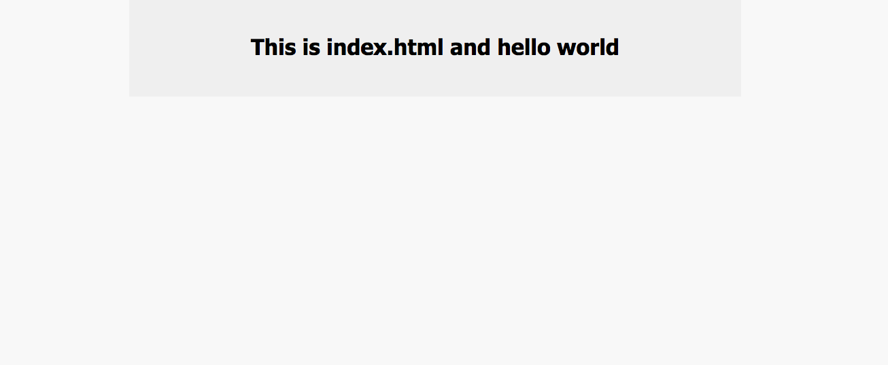

# MEAN App    <<< work in progress  >>>

### mean_project folder:

#### 1. tech_involved (my notes about this project)

-   a few notes about MEAN stack
-   what each of these technologies do,
-   what asynchrounous is, 
-   why is NoSql a far better choice than MySql for this project,
-   what are the advantages of new document databases and 
-   what do they mean by object based as opposed to real OODBs 
-   express is what Sinatra is to Ruby - an MVC for the back-end
-   angular a spa that handles all Ajax requests without refresh and 
    works well with mongodb, and nodejs.

#### 2. getting_started (steps to get your project up and running)

     
 

screenshot 1

